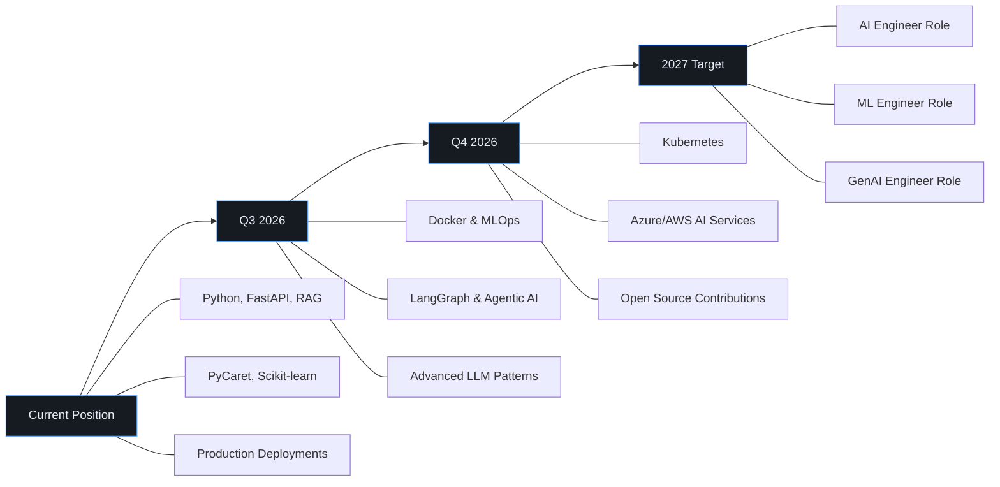

<!-- Header Banner -->
<div align="center">


</div>

<!-- Typing Animation -->
<div align="center">

[](https://git.io/typing-svg)

</div>

<!-- Badges -->
<div align="center">

[](https://ravivarmanportfolio.vercel.app/)
[](https://www.linkedin.com/in/ravivarman-r-b9407527a)
[](mailto:arravi1015@gmail.com)
[](https://github.com/Ravivarman15)

</div>

<br/>

<!-- About Section -->
## About

MCA (Data Science) graduate with hands-on experience building end-to-end AI systems — from multi-agent AutoML platforms to production RAG chatbots handling live user traffic. **Datathon Winner** with demonstrated ability to transform data into deployed, scalable applications.

Currently working as a **Data Science & Generative AI Intern at ARK Learning Arena**, where I build RAG-based WhatsApp automation systems and AI-powered knowledge retrieval solutions. My projects have reduced manual data science effort by ~70% and improved chatbot response efficiency by ~60%.

I work primarily with **Python**, **FastAPI**, **LangChain**, **PyCaret**, **ChromaDB**, and **Supabase**, with growing expertise in **Agentic AI**, **Vector Databases**, and **LLMOps**.

<div align="center">


</div>

<br/>

<!-- Tech Stack -->
## Tech Stack

<table>
<tr>
<td width="50%" valign="top">

**Languages & Core**
```
Python         ████████████████████  Primary
SQL            ████████████████░░░░  Proficient
```

**Machine Learning & Data Science**
```
Scikit-learn   ████████████████████  Advanced
PyCaret        ████████████████████  Advanced
XGBoost        ████████████████████  Advanced
TensorFlow     ████████████████░░░░  Proficient
```

**Statistics & Analysis**
```
Hypothesis Testing  ████████████████  Proficient
Inferential Stats   ████████████████  Proficient
Time Series         ██████████████░░  Proficient
Probability         ████████████████  Proficient
```

</td>
<td width="50%" valign="top">

**Generative AI & LLMs**
```
LangChain      ████████████████████  Advanced
RAG Pipelines  ████████████████████  Advanced
ChromaDB       ████████████████████  Advanced
Hugging Face   ████████████████░░░░  Proficient
Agentic AI     ██████████████░░░░░░  Building
Prompt Eng.    ████████████████░░░░  Proficient
```

**Backend & Deployment**
```
FastAPI        ████████████████████  Advanced
Flask          ████████████████████  Advanced
Streamlit      ████████████████████  Advanced
REST APIs      ████████████████████  Advanced
Supabase       ████████████████░░░░  Proficient
```

</td>
</tr>
</table>

<details>
<summary><b>Full Technology Map</b></summary>
<br/>

| Category | Technologies |
|:---|:---|
| **Programming** | Python, SQL |
| **ML & Data Science** | Supervised/Unsupervised Learning, Regression, Classification, Clustering, Feature Engineering, Hyperparameter Tuning, Predictive Modeling, PCA, Cross Validation |
| **Libraries** | Scikit-learn, PyCaret, TensorFlow, XGBoost, Pandas, NumPy, Matplotlib, Seaborn |
| **Generative AI** | LangChain, RAG, LLMs, Hugging Face, Transformers, Embeddings, Semantic Search, Prompt Engineering, Agentic AI |
| **Vector Databases** | ChromaDB, Pinecone, Vector Embeddings, Similarity Search, ANN Retrieval |
| **Statistics** | Probability, Descriptive & Inferential Statistics, Hypothesis Testing, Time Series Forecasting |
| **Backend & APIs** | FastAPI, Flask, Streamlit, REST APIs, AI Model Integration |
| **Databases** | MySQL, SQLite, Supabase |
| **Visualization & BI** | Power BI, Dashboard Development, KPI Reporting, EDA & Business Insights |
| **Automation** | Zapier, AiSensy API |
| **Cloud & Tools** | IBM Cloud, Git, GitHub, Jupyter Notebook, Google Colab, Docker (learning) |

</details>

<br/>

<!-- Data Science Expertise -->
## Data Science Expertise

<table>
<tr>
<td width="50%" valign="top">

### Methodology & Process
```
┌─────────────────────────────────┐
│  1. Problem Definition          │
│  2. Data Collection & Cleaning  │
│  3. Exploratory Data Analysis   │
│  4. Feature Engineering         │
│  5. Model Selection & Training  │
│  6. Evaluation & Tuning         │
│  7. Deployment & Monitoring     │
└─────────────────────────────────┘
```

**Statistical Analysis**
- Descriptive & Inferential Statistics
- Hypothesis Testing (t-test, chi-square, ANOVA)
- Probability Distributions
- Confidence Intervals & p-values
- Correlation & Regression Analysis
- Time Series Forecasting

</td>
<td width="50%" valign="top">

### ML Techniques

| Type | Algorithms |
|:---|:---|
| **Supervised** | Linear/Logistic Regression, Decision Trees, Random Forest, XGBoost, SVM |
| **Unsupervised** | K-Means, Hierarchical Clustering, PCA, DBSCAN |
| **Evaluation** | Accuracy, F1-Score, Precision, Recall, AUC-ROC, RMSE, MAE |
| **Optimization** | Hyperparameter Tuning, Cross Validation, Grid/Random Search |
| **AutoML** | PyCaret (end-to-end automated model comparison & selection) |

### Data Engineering
- Missing value imputation & outlier detection
- Feature encoding (One-Hot, Label, Target)
- Feature scaling & normalization
- Dimensionality reduction (PCA)
- Data pipeline design & automation
- EDA with Pandas, Matplotlib, Seaborn

</td>
</tr>
</table>

<details>
<summary><b>Domain Experience</b></summary>
<br/>

| Domain | What I Built | Key Metrics |
|:---|:---|:---|
| **Finance** | Loan approval prediction, financial risk scoring, cash flow forecasting | 1st Place Datathon, XGBoost classifier |
| **Healthcare** | Heart disease & diabetes prediction, medicine recommendation engine | Multi-model Flask platform |
| **Retail** | Sales forecasting, demand prediction, revenue analytics | Time series, Power BI dashboards |
| **Weather** | Rainfall prediction using meteorological data (Kaggle) | Binary classification, feature engineering |
| **Business Intelligence** | Multi-country sales dashboards, KPI reporting, trend analysis | Power BI, DAX, real-time insights |
| **Conversational AI** | RAG chatbot, knowledge retrieval, automated FAQ systems | <2s response, 3-language support |

</details>

<br/>

<!-- Flagship Project -->
## Flagship Project

### AgentIQ AI — Multi-Agent AI Data Science Platform

> **Enterprise-ready platform that automates the entire data science pipeline — reducing manual effort by ~70%.**

<table>
<tr>
<td width="60%" valign="top">

A multi-agent AI platform that automates dataset profiling, intelligent feature selection, AutoML model generation, visualization, and report creation. Built a **RAG system using LangChain and ChromaDB** for semantic search and natural language querying over datasets.

**Key Impact:**
- ~70% reduction in manual data science effort
- Automated PDF/PPT report generation
- Semantic search over uploaded datasets
- Multi-model comparison via PyCaret AutoML

</td>
<td width="40%" valign="top">

**Architecture**
```
User Upload → Dataset Profiling
     ↓
Feature Selection → AutoML
     ↓
Model Comparison → Best Model
     ↓
RAG Chat ← LangChain + ChromaDB
     ↓
Reports (PDF/PPT) + Dashboards
```

</td>
</tr>
</table>

| | |
|:---|:---|
| **Stack** | `Python` `FastAPI` `PyCaret` `LangChain` `ChromaDB` `RAG` `HuggingFace` `Supabase` `SQLite` `REST APIs` |

[](https://agentiqai.vercel.app/)
[](https://github.com/Ravivarman15/AgentIQ-AI)

---

<details>
<summary><h3>View All Projects →</h3></summary>
<br/>

#### ARK AI Bot — Production RAG WhatsApp Automation `DEPLOYED`

> Built at ARK Learning Arena. Live 24/7 chatbot automating admissions via WhatsApp.

| | |
|:---|:---|
| **What** | RAG-based WhatsApp chatbot with lead management pipeline |
| **Impact** | ~60% improved response efficiency, ~70% reduced latency (<2s), 3-language support |
| **How** | Migrated vector-based RAG → page-index retrieval. AiSensy API + Zapier automation |
| **Stack** | `Python` `Flask` `FastAPI` `RAG` `LLM` `Supabase` `Zapier` |

[](https://wa.me/918062962717?text=Tell%20me%20about%20Ark%20Learning%20Arena)

---

#### Loan Prediction System — 🏆 Datathon Winner (1st Place) `DEPLOYED`

> TransOrg Analytics Datathon. Multi-page Streamlit app with real-time prediction + Power BI dashboards.

| | |
|:---|:---|
| **What** | End-to-end ML pipeline: preprocessing → feature engineering → multi-algorithm comparison → deployment |
| **Models** | Random Forest, Decision Tree, XGBoost |
| **Recognition** | **1st Place — TransOrg Analytics Datathon** |
| **Stack** | `Python` `Scikit-learn` `XGBoost` `Streamlit` `Power BI` |

---

#### Finx AI — Financial Intelligence System

> ML-powered finance analytics: cash flow prediction, risk scoring, anomaly detection.

| | |
|:---|:---|
| **What** | Income/expense analysis → future predictions → risk scores → optimization recommendations |
| **Stack** | `Python` `Flask` `XGBoost` `MySQL` `Matplotlib` |

---

#### AI-Powered Hospital Platform

> Healthcare platform with 3 integrated ML models: heart disease, diabetes prediction, medicine suggestions.

| | |
|:---|:---|
| **Stack** | `Python` `Flask` `Scikit-learn` `HTML/CSS/JS` |

---

#### Other Projects

| Project | Domain | Tech |
|:---|:---|:---|
| **Heart Disease Prediction** | Healthcare | Python, Flask, Scikit-learn |
| **Roosman Sales Prediction** | Retail | Python, Flask, Scikit-learn |
| **Australia Weather Prediction** | Kaggle | Python, Scikit-learn, Pandas |
| **Sales Performance Dashboard** | Business Intelligence | Power BI, DAX, Excel |
| **Live Weather Dashboard** | Weather Analytics | Python, Power BI, APIs |

</details>

<br/>

<!-- Why Hire Me -->
## Why Hire Me

<table>
<tr>
<td width="55%">

```
Most fresh graduates build Jupyter notebook projects.
I build deployed applications that handle real users.
```

| What I Do | Evidence |
|:---|:---|
| **Win competitions** | **1st Place — TransOrg Analytics Datathon** |
| **Build production AI** | ARK AI Bot — ~60% efficiency, ~70% latency reduction |
| **End-to-end ML pipelines** | AgentIQ AI — ~70% effort reduction via AutoML |
| **RAG systems** | Vector-based & vector-less RAG with LangChain |
| **Data-driven decisions** | Power BI dashboards, KPI reporting, EDA |
| **Statistical modeling** | Hypothesis testing, predictive modeling, feature engineering |
| **API development** | FastAPI/Flask backends powering production systems |
| **Deploy & scale** | Render, Vercel, Streamlit deployments |

</td>
<td width="45%" valign="top">

### At a Glance

```text
🏆 Datathon Winner (1st Place)
📊 9.0 CGPA — MCA Data Science
🤖 3 Production AI Systems Deployed
📈 8+ ML Models Built & Evaluated
🔬 6 Industry Domains Covered
💬 RAG Chatbot — 24/7 Live Users
📉 ~70% Manual Effort Reduction
⚡ <2s Response Time (Optimized RAG)
🌐 3-Language NLP Support
📋 5+ Certifications (AI/ML/Cloud)
```

</td>
</tr>
</table>

<br/>

<!-- Experience -->
## Experience

**Data Science & Generative AI Intern** — ARK Learning Arena `Feb 2026 – Present`
- Developing AI-powered automation solutions using Machine Learning and Generative AI for production business use cases.
- Built RAG-based WhatsApp chatbot systems for automated knowledge retrieval and FAQ answering, improving response efficiency by ~60%.
- Optimized RAG architecture from vector-based to page-index retrieval, reducing response latency by ~70%.

**AI & Cloud Engineering Intern** — IBM SkillBuild `Jul – Aug 2025`
- Implemented machine learning algorithms using IBM Cloud services. Gained hands-on experience with classification, regression, and clustering.
- Deployed ML models using IBM Watson Studio and AutoAI tools.

---

## Education

| Degree | Institution | Year | CGPA |
|:---|:---|:---|:---|
| **MCA (Data Science)** | Takshashila University | 2024 – 2026 | **9.0 / 10.0** |
| **B.Com (Computer Application)** | Sri Malolan College of Arts & Science | 2021 – 2024 | **7.8 / 10.0** |

<br/>

<!-- Achievements -->
## Achievements

- **1st Place Winner — TransOrg Analytics Datathon** — Built a scalable Loan Prediction ML system beating competing teams
- Deployed **AgentIQ AI** — enterprise-ready multi-agent AutoML + RAG platform at [agentiqai.vercel.app](https://agentiqai.vercel.app/)
- Built and deployed **ARK AI Bot** — production WhatsApp chatbot handling real user conversations 24/7 with ~60% efficiency improvement
- Completed **Data Science & Machine Learning** certification — Intellipaat
- Completed **GenAI-Powered Data Analytics** — TATA
- Completed **IBM SkillBuild AI & Cloud** internship with Watson Studio and AutoAI deployment
- Earned certifications in **Python, AI, Cloud Computing, Data Visualization, Quantum Computing**
- Built **8+ ML models** across healthcare, finance, sales, and weather prediction domains

<br/>

<!-- GitHub Stats -->
## GitHub Analytics

<div align="center">


</div>

<div align="center">


</div>

<div align="center">


</div>

<div align="center">

[](https://github.com/ryo-ma/github-profile-trophy)

</div>

<br/>

<!-- Currently Learning -->
## Currently Learning

<table>
<tr>
<td width="50%">

**MLOps & Infrastructure**
```text
MLOps          ███████████░░░░░░░░░  In Progress
Docker         ██████████░░░░░░░░░░  In Progress
Kubernetes     ██████░░░░░░░░░░░░░░  Getting Started
LLMOps         ██████░░░░░░░░░░░░░░  Getting Started
```

</td>
<td width="50%">

**AI & Cloud**
```text
LangGraph      █████████░░░░░░░░░░░  In Progress
Agentic AI     █████████░░░░░░░░░░░  In Progress
Azure AI       ██████░░░░░░░░░░░░░░  Getting Started
AWS SageMaker  █████░░░░░░░░░░░░░░░  Planned
Vector DBs     ████████████████░░░░  Proficient
Adv. NLP       ████████████░░░░░░░░  In Progress
```

</td>
</tr>
</table>

<br/>

<!-- 2026 Roadmap -->
## 2026 Career Roadmap



<br/>

<!-- Philosophy -->
## Development Philosophy

```
1. Build real applications, not just notebooks.
2. Every model should have an API. Every API should be deployed.
3. Write code that another engineer can read and extend.
4. Learn by shipping — production teaches what tutorials can't.
5. AI should solve problems people actually have.
```

<br/>

<!-- Open Source -->
## Open Source

Currently focused on building a strong foundation in production AI engineering. My near-term open source goals:

- Contributing to **LangChain** and **PyCaret** ecosystems
- Publishing reusable **RAG pipeline templates**
- Sharing **FastAPI + ML deployment patterns**
- Building tools that help other engineers ship AI faster

<br/>

<!-- Fun Facts -->
## A Few Things

- I've optimized a RAG system to respond in under 2 seconds without vector databases — a ~70% latency reduction
- My WhatsApp bot handles conversations in 3 languages: English, Tamil, and Thanglish
- I won my first datathon by building a production-grade ML system, not just a notebook
- I went from B.Com to MCA Data Science (9.0 CGPA) because I wanted to build, not just analyze
- I believe the best way to learn AI is to deploy it where real users can break it

<br/>

<!-- Contact -->
## Let's Connect

<div align="center">

[](https://ravivarmanportfolio.vercel.app/)
[](https://www.linkedin.com/in/ravivarman-r-b9407527a)
[](https://github.com/Ravivarman15)
[](mailto:arravi1015@gmail.com)

</div>

<br/>

<!-- Footer -->
<div align="center">


</div>

<div align="center">


</div>
