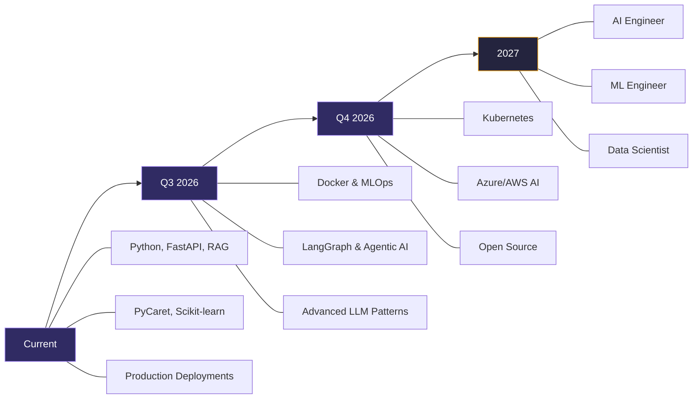

<div align="center">


</div>

<div align="center">

[](https://git.io/typing-svg)

</div>

<div align="center">

[](https://ravivarmanportfolio.vercel.app/)
[](https://www.linkedin.com/in/ravivarman-r-b9407527a)
[](mailto:arravi1015@gmail.com)
[](https://github.com/Ravivarman15)

</div>

<br/>


<br/>

##  &nbsp;About Me


MCA (Data Science) graduate building end-to-end AI systems — from **multi-agent AutoML platforms** to **production RAG chatbots** handling live user traffic. My projects have **reduced manual effort by ~70%** and **improved response efficiency by ~60%**.

Currently working as a **Data Science & Generative AI Intern** at **ARK Learning Arena**, building RAG-based WhatsApp automation and AI-powered knowledge retrieval systems.

<div align="center">

**`Python`** · **`Scikit-learn`** · **`LangChain`** · **`PyCaret`** · **`FastAPI`** · **`ChromaDB`** · **`Power BI`** · **`XGBoost`** · **`Streamlit`**

</div>

<br/>


<br/>

##  &nbsp;Tech Stack

<div align="center">

<table>
<tr>
<td align="center" width="96">

<br><b>Python</b>
</td>
<td align="center" width="96">

<br><b>FastAPI</b>
</td>
<td align="center" width="96">

<br><b>Flask</b>
</td>
<td align="center" width="96">

<br><b>TensorFlow</b>
</td>
<td align="center" width="96">

<br><b>Scikit-learn</b>
</td>
<td align="center" width="96">

<br><b>Pandas</b>
</td>
<td align="center" width="96">

<br><b>NumPy</b>
</td>
</tr>
<tr>
<td align="center" width="96">

<br><b>MySQL</b>
</td>
<td align="center" width="96">

<br><b>SQLite</b>
</td>
<td align="center" width="96">

<br><b>Git</b>
</td>
<td align="center" width="96">

<br><b>Jupyter</b>
</td>
<td align="center" width="96">

<br><b>Streamlit</b>
</td>
<td align="center" width="96">

<br><b>Docker</b>
</td>
<td align="center" width="96">

<br><b>GitHub</b>
</td>
</tr>
</table>

</div>

<br/>

<div align="center">


</div>

<br/>

<details>
<summary><b>&nbsp;Full Skills Breakdown</b></summary>
<br/>

| Category | Technologies |
|:---|:---|
| **Programming** | Python, SQL |
| **ML & Data Science** | Supervised/Unsupervised Learning, Regression, Classification, Clustering, Feature Engineering, Hyperparameter Tuning, Predictive Modeling, PCA, Cross Validation |
| **Generative AI** | LangChain, RAG, LLMs, Hugging Face, Transformers, Embeddings, Semantic Search, Prompt Engineering, Agentic AI |
| **Vector Databases** | ChromaDB, Pinecone, Vector Embeddings, Similarity Search, ANN Retrieval |
| **Statistics** | Probability, Descriptive & Inferential Statistics, Hypothesis Testing, Time Series Forecasting |
| **Backend & APIs** | FastAPI, Flask, Streamlit, REST APIs, AI Model Integration |
| **Databases** | MySQL, SQLite, Supabase |
| **Visualization** | Power BI, Matplotlib, Seaborn, Dashboard Development, KPI Reporting |
| **Automation** | Zapier, AiSensy API |
| **Cloud & Tools** | IBM Cloud, Git, GitHub, Jupyter, Google Colab, Docker (learning) |

</details>

<br/>


<br/>

##  &nbsp;Data Science Expertise

<table>
<tr>
<td width="50%" valign="top">

### 📊 Data Science Lifecycle
<table>
<tr><td><b>1. 🎯 Problem Definition</b><br>Scoping business objectives & KPIs</td></tr>
<tr><td><b>2. 🧹 Data Preparation</b><br>Ingestion, cleaning, & outlier handling</td></tr>
<tr><td><b>3. 🔍 Exploratory Data Analysis</b><br>Univariate/multivariate correlation analysis</td></tr>
<tr><td><b>4. ⚙️ Feature Engineering</b><br>Selection, encoding, scaling & PCA</td></tr>
<tr><td><b>5. 🤖 Model Development</b><br>Multi-model training & AutoML selection</td></tr>
<tr><td><b>6. 📈 Tuning & Evaluation</b><br>Cross-validation & metric optimization</td></tr>
<tr><td><b>7. 🚀 Deployment</b><br>FastAPI endpoints & dashboard reporting</td></tr>
</table>

#### Statistical Methods
- Hypothesis Testing (t-test, chi-square, ANOVA)
- Probability Distributions & Confidence Intervals
- Correlation & Regression Analysis
- Descriptive & Inferential Statistics
- Time Series Forecasting

</td>
<td width="50%" valign="top">

### 🤖 ML Algorithms

| Type | Techniques |
|:---|:---|
| **Supervised** | Linear/Logistic Regression, Decision Trees, Random Forest, XGBoost, SVM |
| **Unsupervised** | K-Means, Hierarchical Clustering, PCA, DBSCAN |
| **Evaluation** | F1-Score, Precision, Recall, AUC-ROC, RMSE, MAE |
| **Optimization** | Grid/Random Search, Cross Validation |
| **AutoML** | PyCaret (automated model comparison) |

#### Data Engineering
- Missing value imputation & outlier detection
- Feature encoding (One-Hot, Label, Target)
- Feature scaling, normalization & PCA
- Data pipeline automation
- EDA with Pandas, Matplotlib, Seaborn

</td>
</tr>
</table>

<details>
<summary><b>&nbsp;Domain Experience</b></summary>
<br/>

| Domain | What I Built | Key Metrics |
|:---|:---|:---|
| **Finance** | Loan prediction, risk scoring, cash flow forecasting | 🏆 1st Place Datathon |
| **Healthcare** | Heart disease & diabetes prediction, medicine engine | Multi-model platform |
| **Retail** | Sales forecasting, demand prediction, revenue analytics | Power BI dashboards |
| **Weather** | Rainfall prediction (Kaggle) | Binary classification |
| **Business Intelligence** | Multi-country dashboards, KPI reporting | Power BI, DAX |
| **Conversational AI** | RAG chatbot, knowledge retrieval | <2s, 3-language |

</details>

<br/>


<br/>

##  &nbsp;Flagship Project

<div align="center">

### `AgentIQ AI` — Multi-Agent Data Science Platform

[](https://agentiqai.vercel.app/)
[](https://github.com/Ravivarman15/AgentIQ-AI)

</div>

> **Enterprise-ready platform automating the entire data science pipeline — reducing manual effort by ~70%**

<table>
<tr>
<td width="55%" valign="top">

#### What It Does
Upload any dataset and the platform automatically:

- 📊 **Profiles** your data with statistical summaries
- 🧠 **Selects features** intelligently using ML techniques
- ⚡ **Trains & compares** multiple models via PyCaret AutoML
- 💬 **Answers questions** about your data using RAG + LangChain
- 📄 **Generates reports** (PDF/PPT) with insights & visualizations

#### Impact
```diff
+ ~70% reduction in manual data science effort
+ Automated multi-model comparison & selection
+ Natural language querying over any dataset
+ Professional report generation in minutes
```

</td>
<td width="45%" valign="top">

#### ⚙️ Data Pipeline Workflow
<table>
<tr><td><b>Step 1: Dataset Ingestion</b><br>📁 User uploads CSV, Excel, or JSON</td></tr>
<tr><td><b>Step 2: Auto-Profiling & EDA</b><br>📊 Statistics & feature selection algorithms</td></tr>
<tr><td><b>Step 3: AutoML Engine</b><br>⚡ PyCaret compares models to find best metrics</td></tr>
<tr><td><b>Step 4: RAG Chat Interface</b><br>💬 LangChain + ChromaDB semantic querying</td></tr>
<tr><td><b>Step 5: Automated Delivery</b><br>📄 PDF/PPT reports + live visualization</td></tr>
</table>

</td>
</tr>
</table>

<div align="center">

`Python` `FastAPI` `PyCaret` `LangChain` `ChromaDB` `RAG` `HuggingFace` `Supabase` `SQLite` `REST APIs`

</div>

---

<details>
<summary><h3>&nbsp;📁 View All Projects →</h3></summary>
<br/>

#### ARK AI Bot — Production RAG WhatsApp Chatbot &nbsp; `🟢 LIVE`

> Built at ARK Learning Arena — live 24/7 chatbot automating admissions via WhatsApp.

| | |
|:---|:---|
| **Impact** | ~60% improved response efficiency · ~70% reduced latency (<2s) · 3 languages |
| **How** | Migrated vector-based RAG → page-index retrieval · AiSensy API + Zapier automation |
| **Stack** | `Python` `Flask` `FastAPI` `RAG` `LLM` `Supabase` `Zapier` |

[](https://wa.me/918062962717?text=Tell%20me%20about%20Ark%20Learning%20Arena)

---

#### Loan Prediction System &nbsp; `🏆 1ST PLACE`

> TransOrg Analytics Datathon Winner. Multi-page Streamlit app + Power BI dashboards.

| | |
|:---|:---|
| **Pipeline** | Preprocessing → Feature Engineering → Multi-Algorithm Comparison → Deployment |
| **Models** | Random Forest · Decision Tree · XGBoost |
| **Stack** | `Python` `Scikit-learn` `XGBoost` `Streamlit` `Power BI` |

---

#### Finx AI — Financial Intelligence

> Cash flow prediction, risk scoring, anomaly detection for businesses.

| **Stack** | `Python` `Flask` `XGBoost` `MySQL` `Matplotlib` |
|:---|:---|

---

#### AI Hospital Platform

> 3 ML models: heart disease prediction, diabetes prediction, medicine suggestions.

| **Stack** | `Python` `Flask` `Scikit-learn` `HTML/CSS/JS` |
|:---|:---|

---

| Project | Domain | Tech |
|:---|:---|:---|
| **Heart Disease Prediction** | Healthcare | Scikit-learn, Flask |
| **Roosman Sales Prediction** | Retail | Scikit-learn, Flask |
| **Australia Weather Prediction** | Kaggle | Scikit-learn, Pandas |
| **Sales Dashboard** | BI | Power BI, DAX |
| **Live Weather Dashboard** | Analytics | Power BI, APIs |

</details>

<br/>


<br/>

##  &nbsp;Why Hire Me

<table>
<tr>
<td width="55%" valign="top">

```
Most graduates build notebooks.
I build deployed systems that handle real users.
```

| Capability | Proof |
|:---|:---|
| 🏆 **Win competitions** | 1st Place — TransOrg Datathon |
| 🚀 **Production AI** | ARK Bot — ~60% efficiency, ~70% latency ↓ |
| 🔬 **End-to-end ML** | AgentIQ — ~70% effort reduction |
| 🧠 **RAG systems** | Vector & vector-less RAG with LangChain |
| 📊 **Data-driven insights** | Power BI dashboards, KPI, EDA |
| 📐 **Statistical modeling** | Hypothesis testing, predictive models |
| ⚙️ **API development** | FastAPI/Flask production backends |
| ☁️ **Deploy & scale** | Render, Vercel, Streamlit |

</td>
<td width="45%" valign="top">

<div align="center">

### ⚡ Quick Statistics
<table>
<tr><td>🏆 <b>Datathon Winner</b> (1st Place)</td></tr>
<tr><td>📊 <b>9.0 CGPA</b> — MCA Data Science</td></tr>
<tr><td>🤖 <b>3 Production AI Systems</b> Deployed</td></tr>
<tr><td>📈 <b>8+ ML Models</b> Built & Evaluated</td></tr>
<tr><td>🔬 <b>6 Industry Domains</b> Covered</td></tr>
<tr><td>💬 <b>RAG WhatsApp Bot</b> — 24/7 Live Traffic</td></tr>
<tr><td>📉 <b>~70% Effort Reduction</b> (AutoML)</td></tr>
<tr><td>⚡ <b><2s Response Time</b> (Optimized RAG)</td></tr>
<tr><td>🌐 <b>3-Language</b> NLP Support</td></tr>
<tr><td>📋 <b>5+ Professional Certifications</b></td></tr>
</table>

</div>

</td>
</tr>
</table>

<br/>


<br/>

##  &nbsp;Experience & Education

<table>
<tr>
<td width="50%" valign="top">

### 💼 Experience

**Data Science & GenAI Intern**
*ARK Learning Arena* · `Feb 2026 – Present`
- Built RAG-based WhatsApp chatbots for knowledge retrieval
- ~60% improved response efficiency, ~70% reduced latency
- Production ML + Generative AI solutions

**AI & Cloud Intern**
*IBM SkillBuild* · `Jul – Aug 2025`
- ML algorithms on IBM Cloud
- Watson Studio & AutoAI deployment

</td>
<td width="50%" valign="top">

### 🎓 Education

| | |
|:---|:---|
| **MCA (Data Science)** | Takshashila University |
| *2024 – 2026* | **CGPA: 9.0 / 10.0** |
| | |
| **B.Com (Computer App)** | Sri Malolan College |
| *2021 – 2024* | **CGPA: 7.8 / 10.0** |

### 🏅 Certifications
- Data Science & ML — *Intellipaat*
- GenAI Powered Analytics — *TATA*
- AI & Cloud — *IBM SkillBuild*
- Python, Data Viz, Quantum Computing

</td>
</tr>
</table>

<br/>

##  &nbsp;Achievements

<div align="center">


</div>

<br/>


<br/>

##  &nbsp;GitHub Analytics

<div align="center">


</div>

<div align="center">


</div>

<div align="center">


</div>

<div align="center">

[](https://github.com/ryo-ma/github-profile-trophy)

</div>

<br/>


<br/>

##  &nbsp;Currently Learning

<div align="center">

<table>
<tr>
<td width="50%">

**MLOps & Infrastructure**
```text
MLOps          ███████████░░░░░░░░░  In Progress
Docker         ██████████░░░░░░░░░░  In Progress
Kubernetes     ██████░░░░░░░░░░░░░░  Getting Started
LLMOps         ██████░░░░░░░░░░░░░░  Getting Started
```

</td>
<td width="50%">

**AI & Cloud**
```text
LangGraph      █████████░░░░░░░░░░░  In Progress
Agentic AI     █████████░░░░░░░░░░░  In Progress
Azure AI       ██████░░░░░░░░░░░░░░  Getting Started
AWS SageMaker  █████░░░░░░░░░░░░░░░  Planned
Adv. NLP       ████████████░░░░░░░░  In Progress
```

</td>
</tr>
</table>

</div>

<br/>

<details>
<summary><b>&nbsp;2026 Career Roadmap</b></summary>
<br/>



</details>

<br/>


<br/>

##  &nbsp;Philosophy

```
① Build real applications, not just notebooks.
② Every model should have an API. Every API should be deployed.
③ Write code that another engineer can read and extend.
④ Learn by shipping — production teaches what tutorials can't.
⑤ AI should solve problems people actually have.
```

<br/>

##  &nbsp;Let's Connect

<div align="center">

[](https://ravivarmanportfolio.vercel.app/)
[](https://www.linkedin.com/in/ravivarman-r-b9407527a)
[](https://github.com/Ravivarman15)
[](mailto:arravi1015@gmail.com)

<br/>


<br/>


</div>
