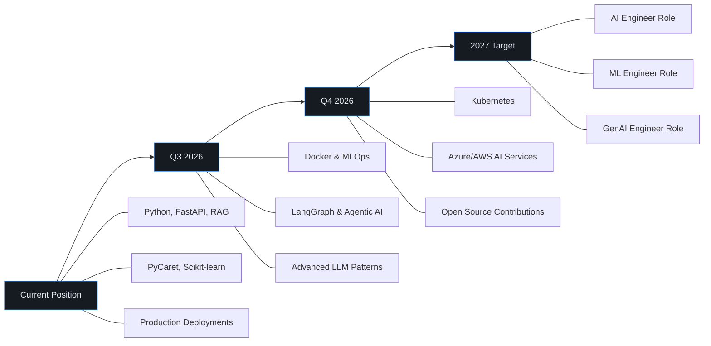

<!-- Header Banner -->
<div align="center">


</div>

<!-- Typing Animation -->
<div align="center">

[](https://git.io/typing-svg)

</div>

<!-- Badges -->
<div align="center">

[](https://ravivarmanportfolio.vercel.app/)
[](https://www.linkedin.com/in/ravivarman-r-b9407527a)
[](mailto:arravi1015@gmail.com)
[](https://github.com/Ravivarman15)

</div>

<br/>

<!-- About Section -->
## About

MCA (Data Science) graduate with hands-on experience building end-to-end AI systems — from multi-agent AutoML platforms to production RAG chatbots handling live user traffic. **Datathon Winner** with demonstrated ability to transform data into deployed, scalable applications.

Currently working as a **Data Science & Generative AI Intern at ARK Learning Arena**, where I build RAG-based WhatsApp automation systems and AI-powered knowledge retrieval solutions. My projects have reduced manual data science effort by ~70% and improved chatbot response efficiency by ~60%.

I work primarily with **Python**, **FastAPI**, **LangChain**, **PyCaret**, **ChromaDB**, and **Supabase**, with growing expertise in **Agentic AI**, **Vector Databases**, and **LLMOps**.

<br/>

<!-- Tech Stack -->
## Tech Stack

<table>
<tr>
<td width="50%" valign="top">

**Languages & Core**
```
Python         ████████████████████  Primary
SQL            ████████████████░░░░  Proficient
```

**Machine Learning & Data Science**
```
Scikit-learn   ████████████████████  Advanced
PyCaret        ████████████████████  Advanced
XGBoost        ████████████████████  Advanced
TensorFlow     ████████████████░░░░  Proficient
```

**Statistics & Analysis**
```
Hypothesis Testing  ████████████████  Proficient
Inferential Stats   ████████████████  Proficient
Time Series         ██████████████░░  Proficient
Probability         ████████████████  Proficient
```

</td>
<td width="50%" valign="top">

**Generative AI & LLMs**
```
LangChain      ████████████████████  Advanced
RAG Pipelines  ████████████████████  Advanced
ChromaDB       ████████████████████  Advanced
Hugging Face   ████████████████░░░░  Proficient
Agentic AI     ██████████████░░░░░░  Building
Prompt Eng.    ████████████████░░░░  Proficient
```

**Backend & Deployment**
```
FastAPI        ████████████████████  Advanced
Flask          ████████████████████  Advanced
Streamlit      ████████████████████  Advanced
REST APIs      ████████████████████  Advanced
Supabase       ████████████████░░░░  Proficient
```

</td>
</tr>
</table>

<details>
<summary><b>Full Technology Map</b></summary>
<br/>

| Category | Technologies |
|:---|:---|
| **Programming** | Python, SQL |
| **ML & Data Science** | Supervised/Unsupervised Learning, Regression, Classification, Clustering, Feature Engineering, Hyperparameter Tuning, Predictive Modeling, PCA, Cross Validation |
| **Libraries** | Scikit-learn, PyCaret, TensorFlow, XGBoost, Pandas, NumPy, Matplotlib, Seaborn |
| **Generative AI** | LangChain, RAG, LLMs, Hugging Face, Transformers, Embeddings, Semantic Search, Prompt Engineering, Agentic AI |
| **Vector Databases** | ChromaDB, Pinecone, Vector Embeddings, Similarity Search, ANN Retrieval |
| **Statistics** | Probability, Descriptive & Inferential Statistics, Hypothesis Testing, Time Series Forecasting |
| **Backend & APIs** | FastAPI, Flask, Streamlit, REST APIs, AI Model Integration |
| **Databases** | MySQL, SQLite, Supabase |
| **Visualization & BI** | Power BI, Dashboard Development, KPI Reporting, EDA & Business Insights |
| **Automation** | Zapier, AiSensy API |
| **Cloud & Tools** | IBM Cloud, Git, GitHub, Jupyter Notebook, Google Colab, Docker (learning) |

</details>

<br/>

<!-- Featured Projects -->
## Featured Projects

> Projects selected for technical depth, real-world deployment, and business impact.

---

### AgentIQ AI — Multi-Agent AI Data Science Platform

> **Enterprise-ready platform that automates the entire data science pipeline — reducing manual effort by ~70%.**

A multi-agent AI platform where users upload datasets and the system automatically performs dataset profiling, intelligent feature selection, AutoML model generation, interactive visualization, and professional report creation. Built a **RAG system using LangChain and ChromaDB** enabling semantic search and natural language querying over datasets. The PyCaret-powered AutoML engine automates preprocessing, model comparison, and performance evaluation.

**Why it matters:** Non-technical users can perform end-to-end data science without writing code. Optimized embedding retrieval strategies and prompt design ensure fast response times and high answer relevance. Generates automated PDF/PPT reports with bivariate/multivariate analysis and feature correlation insights.

| | |
|:---|:---|
| **Architecture** | FastAPI backend, React/Next.js frontend, PyCaret AutoML, LangChain + ChromaDB RAG, SQLite |
| **Key Engineering** | Multi-agent pipeline, intelligent feature selection, semantic search over datasets, embedding retrieval optimization, automated report generation |
| **Impact** | ~70% reduction in manual data science effort |
| **Stack** | `Python` `FastAPI` `PyCaret` `LangChain` `ChromaDB` `RAG` `HuggingFace` `Supabase` `SQLite` `REST APIs` |

[](https://agentiqai.vercel.app/)
[](https://github.com/Ravivarman15/AgentIQ-AI)

---

### ARK AI Bot — Production RAG-Based WhatsApp Automation

> **Live conversational AI system automating admissions — improved response efficiency by ~60%, response latency reduced by ~70%.**

Production-grade WhatsApp chatbot built with RAG architecture at **ARK Learning Arena** that handles real user conversations, automates lead qualification, and escalates high-intent prospects. Initially implemented vector-based RAG, then **optimized to page-index (vector-less) retrieval**, cutting response latency by ~70% to under 2 seconds. Integrated with AiSensy WhatsApp API for real-time bidirectional messaging and Zapier for workflow automation.

**Why it matters:** Multi-step lead management pipeline (qualification → escalation → hot lead detection) improved response efficiency by ~60%. The bot serves real users 24/7 in 3 languages (English, Tamil, Thanglish), logs leads to Google Sheets automatically, and sends admin alerts — all running on Render.

| | |
|:---|:---|
| **Architecture** | Flask/FastAPI backend, RAG → Page Indexing optimization, Supabase, AiSensy API, Zapier |
| **Key Engineering** | Vector-based to vector-less RAG migration, multi-language NLP, lead scoring pipeline, webhook integrations, real-time bidirectional messaging |
| **Impact** | ~60% improved response efficiency, ~70% reduced latency (<2s), 3-language support |
| **Stack** | `Python` `Flask` `FastAPI` `RAG` `LLM` `Supabase` `AiSensy API` `Zapier` `REST APIs` |

[](https://wa.me/918062962717?text=Tell%20me%20about%20Ark%20Learning%20Arena)
[](https://github.com/Ravivarman15)

---

### Finx AI — Financial Intelligence System

> **ML-powered platform for financial analysis, prediction, and risk assessment.**

An intelligent finance analytics system that analyzes income, expense, and savings data to generate future cash flow predictions, financial risk scores, and anomaly detection for unusual spending patterns. Built with XGBoost models and a Flask backend.

**Why it matters:** Helps individuals and small businesses understand and optimize financial behavior through AI-driven insights, with automated risk scoring and actionable expense optimization recommendations.

| | |
|:---|:---|
| **Architecture** | Flask backend, XGBoost models, MySQL database, Matplotlib visualization |
| **Key Engineering** | Financial risk scoring engine, anomaly detection pipeline, cash flow prediction models, structured report generation |
| **Stack** | `Python` `Flask` `XGBoost` `Pandas` `NumPy` `MySQL` `Matplotlib` |

[](https://github.com/Ravivarman15)

---

### AI-Powered Hospital Platform

> **Full-stack healthcare platform with integrated ML prediction models for heart disease, diabetes, and medicine suggestions.**

A comprehensive hospital management website integrating three ML models — Heart Disease Prediction, Diabetes Prediction, and Personalized Medicine Suggestions. Features appointment booking, patient record management, email notifications, and QR code generation for reports, all served through a Flask backend.

| | |
|:---|:---|
| **Stack** | `Python` `Flask` `Scikit-learn` `HTML/CSS/JS` `Pandas` `NumPy` |

[](https://github.com/Ravivarman15)

---

### Loan Prediction System — Datathon-Winning ML Application

> **1st Place Winner — TransOrg Analytics Datathon. End-to-end ML web application with real-time prediction and analytics dashboards.**

A multi-page Streamlit web application featuring Home, Prediction, Insights, and About modules. Built an end-to-end ML pipeline on Kaggle financial datasets — data preprocessing, missing value handling, feature engineering, encoding, and model evaluation. Implemented and optimized **Random Forest, Decision Tree, and XGBoost** classifiers, achieving high prediction accuracy.

**Why it matters:** Won 1st place by delivering a scalable predictive analytics solution. Features a real-time prediction interface for instant loan eligibility results and dynamic Power BI + Streamlit analytics dashboards visualizing applicant trends, approval distributions, and business insights.

| | |
|:---|:---|
| **Architecture** | Multi-page Streamlit app, Scikit-learn/XGBoost models, Power BI dashboards |
| **Key Engineering** | End-to-end ML pipeline, feature engineering on financial data, multi-algorithm comparison, interactive real-time prediction UI |
| **Recognition** | **1st Place — TransOrg Analytics Datathon** |
| **Stack** | `Python` `Scikit-learn` `XGBoost` `Streamlit` `Power BI` `Pandas` `NumPy` |

[](https://github.com/Ravivarman15)

---

<details>
<summary><b>More Projects</b></summary>
<br/>

| Project | Description | Tech |
|:---|:---|:---|
| **Heart Disease Prediction** | ML system analyzing patient health data to assess heart disease risk | Python, Flask, Scikit-learn |
| **Roosman Sales Prediction** | Forecasting future sales using historical data and seasonal patterns | Python, Flask, Scikit-learn |
| **Australia Weather Prediction** | Kaggle competition — binary classification to predict rainfall | Python, Scikit-learn, Pandas |
| **Sales Performance Dashboard** | Interactive Power BI dashboard for multi-country sales analysis | Power BI, DAX, Excel |
| **Live Weather Dashboard** | Real-time weather monitoring across Indian cities via Weather API | Python, Power BI, APIs |

</details>

<br/>

<!-- Why Hire Me -->
## Why Hire Me

```
Most fresh graduates build Jupyter notebook projects.
I build deployed applications that handle real users.
```

| What I Do | Evidence |
|:---|:---|
| **Win competitions** | **1st Place — TransOrg Analytics Datathon** with a production-grade Loan Prediction system |
| **Build production AI systems** | ARK AI Bot runs 24/7 on WhatsApp — ~60% efficiency gain, ~70% latency reduction |
| **Design end-to-end ML pipelines** | AgentIQ AI automates data ingestion → preprocessing → training → model selection → reporting, reducing effort by ~70% |
| **Implement RAG applications** | Built vector-based and vector-less RAG systems with LangChain, ChromaDB, and page indexing |
| **Develop robust APIs** | FastAPI/Flask backends powering multiple production systems with REST endpoints |
| **Automate business workflows** | Zapier integrations, lead scoring pipelines, multi-language support, automated reporting |
| **Deploy and maintain systems** | Applications running on Render, Vercel, Streamlit with cloud infrastructure management |

<br/>

<!-- Experience -->
## Experience

**Data Science & Generative AI Intern** — ARK Learning Arena `Feb 2026 – Present`
- Developing AI-powered automation solutions using Machine Learning and Generative AI for production business use cases.
- Built RAG-based WhatsApp chatbot systems for automated knowledge retrieval and FAQ answering, improving response efficiency by ~60%.
- Optimized RAG architecture from vector-based to page-index retrieval, reducing response latency by ~70%.

**AI & Cloud Engineering Intern** — IBM SkillBuild `Jul – Aug 2025`
- Implemented machine learning algorithms using IBM Cloud services. Gained hands-on experience with classification, regression, and clustering.
- Deployed ML models using IBM Watson Studio and AutoAI tools.

---

## Education

| Degree | Institution | Year | CGPA |
|:---|:---|:---|:---|
| **MCA (Data Science)** | Takshashila University | 2024 – 2026 | **9.0 / 10.0** |
| **B.Com (Computer Application)** | Sri Malolan College of Arts & Science | 2021 – 2024 | **7.8 / 10.0** |

<br/>

<!-- Achievements -->
## Achievements

- **1st Place Winner — TransOrg Analytics Datathon** — Built a scalable Loan Prediction ML system beating competing teams
- Deployed **AgentIQ AI** — enterprise-ready multi-agent AutoML + RAG platform at [agentiqai.vercel.app](https://agentiqai.vercel.app/)
- Built and deployed **ARK AI Bot** — production WhatsApp chatbot handling real user conversations 24/7 with ~60% efficiency improvement
- Completed **Data Science & Machine Learning** certification — Intellipaat
- Completed **GenAI-Powered Data Analytics** — TATA
- Completed **IBM SkillBuild AI & Cloud** internship with Watson Studio and AutoAI deployment
- Earned certifications in **Python, AI, Cloud Computing, Data Visualization, Quantum Computing**
- Built **8+ ML models** across healthcare, finance, sales, and weather prediction domains

<br/>

<!-- GitHub Stats -->
## GitHub Analytics

<div align="center">


</div>

<div align="center">


</div>

<div align="center">


</div>

<div align="center">

[](https://github.com/ryo-ma/github-profile-trophy)

</div>

<br/>

<!-- Currently Learning -->
## Currently Learning

```text
MLOps          ███████████░░░░░░░░░  In Progress
Docker         ██████████░░░░░░░░░░  In Progress
Kubernetes     ██████░░░░░░░░░░░░░░  Getting Started
LangGraph      █████████░░░░░░░░░░░  In Progress
Agentic AI     █████████░░░░░░░░░░░  In Progress
LLMOps         ██████░░░░░░░░░░░░░░  Getting Started
Azure AI       ██████░░░░░░░░░░░░░░  Getting Started
AWS AI         █████░░░░░░░░░░░░░░░  Planned
Vector DBs     ████████████████░░░░  Proficient
```

<br/>

<!-- 2026 Roadmap -->
## 2026 Career Roadmap



<br/>

<!-- Philosophy -->
## Development Philosophy

```
1. Build real applications, not just notebooks.
2. Every model should have an API. Every API should be deployed.
3. Write code that another engineer can read and extend.
4. Learn by shipping — production teaches what tutorials can't.
5. AI should solve problems people actually have.
```

<br/>

<!-- Open Source -->
## Open Source

Currently focused on building a strong foundation in production AI engineering. My near-term open source goals:

- Contributing to **LangChain** and **PyCaret** ecosystems
- Publishing reusable **RAG pipeline templates**
- Sharing **FastAPI + ML deployment patterns**
- Building tools that help other engineers ship AI faster

<br/>

<!-- Fun Facts -->
## A Few Things

- I've optimized a RAG system to respond in under 2 seconds without vector databases — a ~70% latency reduction
- My WhatsApp bot handles conversations in 3 languages: English, Tamil, and Thanglish
- I won my first datathon by building a production-grade ML system, not just a notebook
- I went from B.Com to MCA Data Science (9.0 CGPA) because I wanted to build, not just analyze
- I believe the best way to learn AI is to deploy it where real users can break it

<br/>

<!-- Contact -->
## Let's Connect

<div align="center">

[](https://ravivarmanportfolio.vercel.app/)
[](https://www.linkedin.com/in/ravivarman-r-b9407527a)
[](https://github.com/Ravivarman15)
[](mailto:arravi1015@gmail.com)

</div>

<br/>

<!-- Footer -->
<div align="center">


</div>

<div align="center">


</div>
